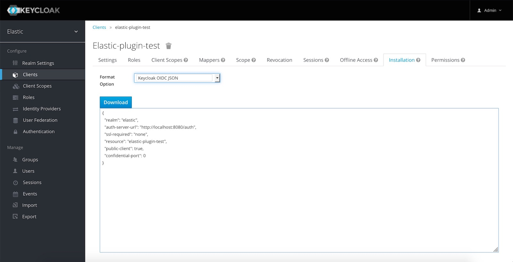

# Keycloak security plugin for Elasticsearch

A Simple xpack security plugin to secure [Elasticsearch](https://www.elastic.co/fr/products/elasticsearch) with [Keycloak](https://www.keycloak.org/) 

## Installation 

- Install plugin 
```
<ES_HOME>/bin/elasticsearch-plugin install https://github.com/fb64/elastic-keycloak-security/releases/download/0.1_es6.4.3/keycloak-security-0.1_es6.4.3.zip
```

- Accept permissions to finish installation

- Permissions details
  - java.lang.RuntimePermission accessDeclaredMembers &rarr; used by keycloak-adapter
  - java.lang.RuntimePermission getClassLoader &rarr; used by keycloak-adapter
  - java.lang.reflect.ReflectPermission suppressAccessChecks &rarr; used by keycloak-adapter
  - java.net.SocketPermission * connect,resolve &rarr; use to communicate with keycloak server


### Configuration

- Get client configuration file from keycloak : (Your Realm)  &rarr; Clients &rarr; (Your client) &rarr; Installation

 

- Copy keycloak client configuration in <ES_HOME>/config/keycloak.config

- Add and configure keycloak realm in <ES_HOME>/config/elasticsearch.yml file :
```YAML
xpack.security.authc.realms.keycloak.order: 0
xpack.security.authc.realms.keycloak.type: keycloak
xpack.security.authc.realms.keycloak.config: keycloak.config
xpack.security.enabled: true
```

- Test integration

```Bash
curl -X GET http://<ES_HOST>:<ES_PORT>/ -H 'Authorization: Bearer <KEYCLOAK TOKEN>'
```

## Development

For development and test you can run a keycloak instance with pre-configured realm by using docker (from repository root directory) :

```Bash
docker run -d -e KEYCLOAK_USER=admin -e KEYCLOAK_PASSWORD=admin -e KEYCLOAK_IMPORT=/tmp/elastic-realm-export.json -v "$(pwd)"/src/test/resources/config/elastic-realm-export.json:/tmp/elastic-realm-export.json -p 8080:8080 jboss/keycloak
```
